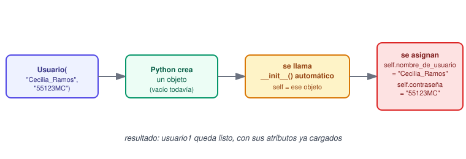
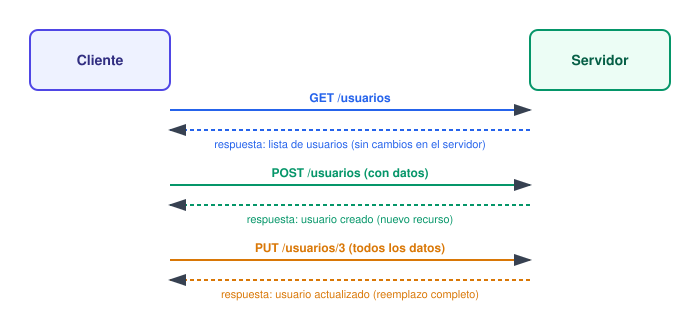
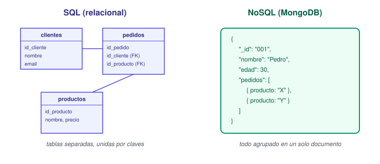
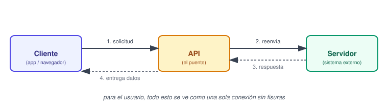
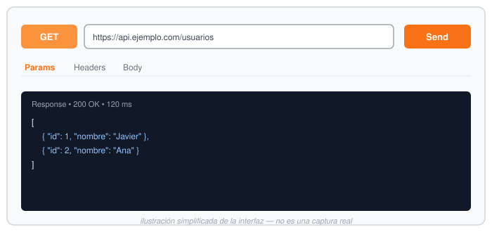

# Checkpoint 6

## ¿Para qué usamos Clases en Python?

Cuando hablamos de clases en Python, nos estamos refiriendo a la base de la programación orientada a objetos. Utilizamos clases para organizar el código en entidades a las que denomina objetos. Cada una de las clases actúa como si fuese un plano o una plantilla para la creación de esos objetos. En ellas, por tanto, se definen los atributos (variables) y los métodos (funciones). Los primeros se encargan de almacenar información del estado del objeto, mientras que los segundos determinan como se comportan.

### Cómo crear clases de Python


Puedes definir clases en Python escribiendo la palabra clave `class` seguida del nombre de la clase y dos puntos.
 
 ```python
class MyClass:
    # Constructor method called when creating an object
    def __init__(self, attribute1, attribute2):
        self.attribute1 = attribute1
        self.attribute2 = attribute2
    
    # Method defined within the class
    def my_method(self):
        return f"Attribute 1: {self.attribute1}, Attribute 2: {self.attribute2}"
```
  
En este código Python, se ha creado una clase llamada `MyClass` que tiene un constructor `__init__` al que se accede al crear un objeto y que inicializa dos atributos, el `attribute1` y el `attribute2`. El método `my_method` devuelve una cadena formateada que contiene los valores de esos atributos.
 
 Para crear un objeto basado en esta clase, debes utilizar el nombre de la clase seguido de paréntesis:
 
```python
object1 = MyClass("Value 1", "Value 2")
# Calling a method of the object
result = object1.my_method()
```
### Ejemplos de uso de las clases de Python
 
Las clases de Python pueden crear sistemas complejos y relaciones entre distintas entidades.

#### La función `__str__()`
 
La función `__str__()` en Python es un método especial que puedes definir dentro de las clases de Python. Cuando se implementa, devuelve una cadena con una representación sencilla de un objeto. Puedes aplicar la función `str()` directamente al objeto o combinarla con una instrucción `print()`.
 
```python
class Person:
    def __init__(self, name, age):
        self.name = name
        self.age = age
    
    def __str__(self):
        return f"Name: {self.name}, Age: {self.age}"
 
person1 = Person("Alice", 30)
print(person1) # Output: Name: Alice, Age: 30
```
 
En este código, el método `__str__()` dentro de la clase `Person` crea una cadena formateada que contiene el nombre y la edad de una persona. Cuando se ejecuta `print(person1)`, llama automáticamente al método `__str__()` del objeto `person1` y da como resultado la cadena que este método ha devuelto.
 
 #### Definir métodos en clases de Python
 
En Python también es posible establecer métodos dentro de una clase para ejecutar operaciones sobre los objetos de esta clase. Por lo tanto, los objetos creados pueden llamar a dichos métodos.
 
 ```python
class Rectangle:
    def __init__(self, length, width):
        self.length = length
        self.width = width
    
    def area(self):
        return self.length * self.width
    def perimeter(self):
        return 2 * (self.length + self.width)
 
# Creating an object of the class
my_rectangle = Rectangle(5, 10)
 
# Calling methods of the object
area = my_rectangle.area()
perimeter = my_rectangle.perimeter()
 
# Printing the calculated values
print("Area =", area) # Output: Area = 50
print("Perimeter =", perimeter) # Output: Perimeter = 30
```
 En el ejemplo anterior, se ha creado la clase `Rectangle`, que incluye los dos métodos `area()` y `perimeter()`. Estos métodos sirven para calcular el área y el perímetro de un rectángulo basándose en los valores de longitud y anchura que se pasaron al inicializar el objeto. En Python, `self` en un método de clase representa una referencia al objeto actual al que se aplica el método.
 
El objeto `my_rectangle` se crea con una longitud de 5 y una anchura de 10. Después, se ha llamado a los métodos `area()` y `perimeter()` sobre este objeto para calcular los valores respectivos.
 
 
#### Cambiar las propiedades de objetos
 
Puedes utilizar el operador punto `.` para acceder a atributos específicos de un objeto y actualizar sus valores. Puedes asignar nuevos valores directamente al atributo tal y como puedes ver a continuación:
 
```python
person1.name = "Sarah"
person1.age = 35
```
 
La palabra clave `del` sirve para eliminar propiedades de un objeto. En el ejemplo que sigue, se está eliminando la propiedad `name` del objeto `person1`:

```python
del person1.name
```
 
## ¿Qué método se ejecuta automáticamente cuando se crea una instancia de una clase?
 
Un constructor en Python es un método especial `__init__()` que se llama automáticamente cuando se crea una nueva instancia de una clase.
 
Su función principal es inicializar los atributos de la instancia con valores predeterminados o personalizados.
 

 
### Sintaxis
 
```python
# Definición de una clase con constructor
class Persona:
    def __init__(self, nombre, edad):
        self.nombre = nombre
        self.edad = edad
 
 
# Creación de instancias utilizando el constructor

persona1 = Persona("Luis", 30)
persona2 = Persona("María", 25)
 
 
# Acceso a los atributos de las instancias

print(persona1.nombre, persona1.edad)  # Salida: Luis 30
print(persona2.nombre, persona2.edad)  # Salida: María 25
```
 
En este ejemplo,
 
- `__init__(self, nombre, edad)` es el constructor de la clase `Persona`
- Cuando se crea una nueva instancia (`persona1` y `persona2`)
- Python automáticamente llama a `__init__()` y pasa los argumentos `nombre` y `edad` proporcionados.

### Parámetros del constructor
 
El primer parámetro de `__init__()` es `self`, que representa la instancia actual de la clase. Se utiliza para acceder a los atributos y métodos de la instancia dentro del propio método y en otros métodos de la clase.
 
Además de `self`, el constructor puede aceptar cualquier número de parámetros necesarios para inicializar la instancia. Estos parámetros son proporcionados al crear la instancia.
 
 ### Definición de atributos opcionales
 
Los constructores pueden definir atributos opcionales con valores predeterminados.

```python
class Coche:
    def __init__(self, marca, modelo, color="negro"):
        self.marca = marca
        self.modelo = modelo
        self.color = color
 
 # Creación de instancias

coche1 = Coche("Toyota", "Corolla")
coche2 = Coche("Tesla", "Model S", "rojo")
 
 
print(coche1.marca, coche1.modelo, coche1.color)  # Salida: Toyota Corolla negro
print(coche2.marca, coche2.modelo, coche2.color)  # Salida: Tesla Model S rojo
```
 
En este ejemplo, `Coche` tiene un atributo opcional `color` con valor predeterminado `"negro"`. Se puede proporcionar un color diferente al crear la instancia (`coche2`).



 ### Constructor predeterminado
 
Si no se define un constructor (`__init__()`), Python proporciona uno por defecto que no inicializa ningún atributo.

## ¿Cuáles son los tres verbos de API?
 
Estos verbos forman parte del protocolo HTTP y son la base de las API REST.
 
- Obtener información (GET)
- Crear un nuevo recurso (POST)
- Actualizar un recurso existente (PUT)



### 1. GET – Obtener recursos
 
El método GET se usa para recuperar información de la API.
 
- Es idempotente: no cambia el estado del servidor.
- No debe modificar datos.
- Se pueden usar parámetros en la URL para filtrar resultados.

Ejemplo de solicitud GET para obtener todos los usuarios:

```http
GET /usuarios HTTP/1.1
Host: api.ejemplo.com
```
 
  
Ejemplo en fetch:
 
```javascript
fetch('https://api.ejemplo.com/usuarios')
  .then(response => response.json())
  .then(data => console.log(data));
```
Ejemplo de respuesta:
 
```json
[
  { "id": 1, "nombre": "Javier" },
  { "id": 2, "nombre": "Ana" }
]
```
 ### 2. POST – Crear un nuevo recurso
 
El método POST se usa para crear un nuevo recurso en el servidor.
 
- No es idempotente (si se envía varias veces, puede crear duplicados).
- La información suele enviarse en el cuerpo de la solicitud.
Ejemplo de solicitud POST para crear un usuario:
 
```http
POST /usuarios HTTP/1.1
Host: api.ejemplo.com
Content-Type: application/json
 
{
  "nombre": "Carlos",
  "email": "carlos@ejemplo.com"
}
```
 
Ejemplo en fetch:
 
```javascript
fetch('https://api.ejemplo.com/usuarios', {
  method: 'POST',
  headers: {
    'Content-Type': 'application/json'
  },
  body: JSON.stringify({ nombre: 'Carlos', email: 'carlos@ejemplo.com' })
});
```
Ejemplo de respuesta:
 
```json
{
  "id": 3,
  "nombre": "Carlos",
  "email": "carlos@ejemplo.com"
}
```
### 3. PUT – Reemplazar un recurso completo
 
El método PUT se usa para actualizar un recurso existente enviando todos sus atributos.
 
- Es idempotente (varias solicitudes con los mismos datos no generan cambios adicionales).
- La especificación HTTP contempla que, si el recurso no existe, PUT pueda crearlo (esto se conoce como comportamiento *upsert*). No todas las APIs lo implementan así; depende del diseño de cada una.

Ejemplo de solicitud PUT para actualizar un usuario:
 
```http
PUT /usuarios/3 HTTP/1.1
Host: api.ejemplo.com
Content-Type: application/json
 
{
  "nombre": "Carlos Pérez",
  "email": "carlos@ejemplo.com"
}
```
Ejemplo en fetch:
 
```javascript
fetch('https://api.ejemplo.com/usuarios/3', {
  method: 'PUT',
  headers: {
    'Content-Type': 'application/json'
  },
  body: JSON.stringify({ nombre: 'Carlos Pérez', email: 'carlos@ejemplo.com' })
});
```
 
 ### Otros verbos HTTP

 Además de estos tres, existen otros verbos que completan el conjunto de operaciones típicas de una API REST (patrón CRUD)


- **PATCH**: para actualizaciones parciales de un recurso (solo se envían los campos que cambian, no el objeto completo).
- **DELETE**: para eliminar un recurso. Generalmente no devuelve datos, solo un código de estado HTTP (204 No Content).

## ¿Es MongoDB una base de datos SQL o NoSQL?
 
Es una base de datos NoSQL, no usa tablas ni un esquema rígido. MongoDB en particular guarda los datos como documentos.


 
Ejemplo:
 
```json
{
  "_id": "001",
  "nombre": "Pedro",
  "edad": 30,
  "hobbies": ["golf", "leer"]
}
```
 Antes de las bases de datos relacionales, las empresas utilizaban un sistema de base de datos jerárquico con una estructura en forma de árbol para las tablas de datos. Estos primeros sistemas de gestión de bases de datos (DBMS) permitían a los usuarios organizar grandes cantidades de datos. Sin embargo, eran complejos, a menudo propios de una aplicación concreta y limitados en cuanto a las formas en que podían descubrir dentro de los datos. Estas limitaciones finalmente llevaron al desarrollo de sistemas de gestión de bases de datos relacionales, que organizaban datos en tablas. SQL proporcionó una interfaz para interactuar con datos relacionales, lo que permitió a los analistas conectar tablas mediante la combinación de campos comunes.
 Con el paso del tiempo, las demandas de un uso más rápido y dispar de grandes conjuntos de datos se volvieron cada vez más importantes para la tecnología emergente, como las aplicaciones de comercio electrónico. Los programadores necesitaban algo más flexible que las bases de datos SQL (es decir, una base de datos relacional). NoSQL se convirtió en esa alternativa.
 Aunque NoSQL supuso una alternativa a SQL, este avance no sustituyó en absoluto a las bases de datos SQL. Por ejemplo, digamos que gestiona pedidos minoristas en una empresa. En un modelo relacional, las tablas individuales administrarían los datos de los clientes, los datos de los pedidos y los datos del producto por separado, y se unirían mediante una clave única y común, como un ID de cliente o un ID de pedido. Aunque esto es estupendo para almacenar y recuperar datos rápidamente, requiere una cantidad considerable de memoria. Cuando desea agregar más memoria, las bases de datos SQL solo pueden escalar verticalmente, no horizontalmente, lo que significa que su capacidad para agregar más memoria está limitada al hardware que tiene. El resultado es que el escalado vertical, en última instancia, limita el almacenamiento y la recuperación de datos de su empresa.
 En comparación, las bases de datos NoSQL no son relacionales, lo que elimina la necesidad de conectar tablas. Sus capacidades integradas de fragmentación y alta disponibilidad facilitan el escalado horizontal. Si un solo servidor de base de datos no es suficiente para almacenar todos sus datos o manejar todas las consultas, la carga de trabajo se puede dividir en dos o más servidores, lo que permite a las empresas escalar sus datos horizontalmente.
 
 ## ¿Qué es una API?
 
**Application Programming Interface** (Interfaz de Programación de Aplicaciones)
 
Es un conjunto de reglas o protocolos que permite a las aplicaciones informáticas comunicarse entre sí para intercambiar datos, características y funcionalidades.
 
Ejemplo: cuando usas una app del clima, la app no calcula el clima por sí misma; le pide esa información a una API externa (por ejemplo, la de un servicio meteorológico), y esa API le responde con los datos.

Las API simplifican y aceleran el desarrollo de aplicaciones y software permitiendo a los desarrolladores integrar datos, servicios y capacidades de otras aplicaciones, en lugar de desarrollarlas desde cero. Las API también ofrecen a los propietarios de aplicaciones una forma sencilla y segura de poner los datos y las funciones de sus aplicaciones a disposición de los departamentos de su organización. Los propietarios de aplicaciones también pueden compartir o comercializar datos y funciones con Business Partners o terceros.
Las API permiten compartir solo la información necesaria, manteniendo ocultos otros detalles internos del sistema, lo que ayuda a la seguridad del sistema. Los servidores o dispositivos no tienen que exponer completamente los datos: las API permiten compartir pequeños paquetes de datos, relevantes para la solicitud específica.
 
  
### ¿Cómo funcionan las API?
 
Es útil pensar en la comunicación de la API en términos de una solicitud y respuesta entre un cliente y un servidor. La aplicación que envía la solicitud es el cliente y el servidor proporciona la respuesta. La API es el puente que establece la conexión entre ellos.
Una forma sencilla de entender cómo funcionan las API es examinar un ejemplo común: el procesamiento de pagos de terceros. Cuando un usuario compra un producto en un sitio de comercio electrónico, es posible que se le pida que "pague con PayPal" u otro tipo de sistema externo. Esta función depende de las API para realizar la conexión.

Cuando el comprador hace clic en el botón de pago, se envía una llamada a la API para recuperar la información. Esta es la petición. Esta solicitud se procesa desde una aplicación al servidor web a través del identificador uniforme de recursos (URI) de la API e incluye un verbo de solicitud, una cabecera y, a veces, un cuerpo de solicitud.
Tras recibir una solicitud válida desde la página web del producto, la API llama al programa externo o al servidor web, en este caso, al sistema de pago externo.
El servidor envía una respuesta a la API con la información solicitada.
La API transfiere los datos a la aplicación solicitante inicial, en este caso, el sitio web del producto.
Si bien la transferencia de datos difiere según el servicio web utilizado, las solicitudes y respuestas se realizan a través de una API. No hay visibilidad en la interfaz de usuario, lo que significa que las API intercambian datos dentro del ordenador o la aplicación, y aparecen ante el usuario como una conexión sin fisuras.

### Tipos de API
 
Las API se pueden clasificar por casos de uso: API de datos, API de sistemas operativos, API remotas y API web.
 
  
#### API web
 
Las API web permiten la transferencia de datos y funcionalidades a través de Internet mediante el protocolo HTTP.
 
Hoy en día, la mayoría de las API son API web. Las API web son un tipo de API remota (lo que significa que la API utiliza protocolos para manipular recursos externos) que exponen los datos y la funcionalidad de una aplicación a través de Internet.
 
 Los cuatro tipos principales de API web son:
 
**API abiertas**
Las API abiertas son interfaces de programación de aplicaciones de código abierto a las que se puede acceder con el protocolo HTTP. También conocidas como API públicas, han definido endpoints de API y formatos de solicitud y respuesta.

**API de socios**
Las API de socios conectan a Business Partners estratégicos. Normalmente, los programadores acceden a estas API en modo de autoservicio a través de un portal público para programadores de API. Aún así, deben completar un proceso de incorporación y obtener credenciales de inicio de sesión para acceder a las API de socios.

**API internas**
Las API internas o privadas permanecen ocultas para los usuarios externos. Estas API privadas no están disponibles para usuarios fuera de la empresa. En cambio, las organizaciones las utilizan para mejorar la productividad y la comunicación entre diferentes equipos de desarrollo internos.

**API compuestas**
Las API compuestas combinan múltiples API de datos o servicios. Permiten a los programadores acceder a varios endpoints en una sola llamada. Las API compuestas son útiles en la arquitectura de microservicios, donde la realización de una única tarea puede requerir información de varias fuentes.
 
  
#### Otros tipos de API
 
Entre los tipos menos comunes de API se incluyen los siguientes:
 
- API de datos (o bases de datos), utilizadas para conectar aplicaciones y sistemas de gestión de bases de datos
- API del sistema operativo (o locales), utilizadas para definir cómo utilizan las apps los servicios y recursos del sistema operativo
- API remotas, utilizadas para definir cómo interactúan las aplicaciones en diferentes dispositivos


## ¿Qué es Postman?
 
Postman es una herramienta diseñada para probar, validar, documentar y automatizar APIs.



En pocas palabras, Postman te permite:
 
- Enviar peticiones HTTP (GET, POST, PUT, DELETE…)
- Probar endpoints REST y GraphQL
- Validar respuestas (códigos de estado, headers, tiempos, payloads)
- Crear colecciones organizadas de pruebas
- Documentar una API automáticamente
- Automatizar tests con JavaScript
- Crear entornos (DEV, QA, PROD) con variables
- Monitorear APIs en segundo plano

## ¿Qué beneficios brinda Postman en el desarrollo de API's?
su versión gratuita es más que suficiente si lo que deseas es desarrollar API's básicas y testearlas para comprobar su buen funcionamiento.
 
- Testeo de catálogos completos de API's que funcionan tanto para desarrollo backend como frontend.
- Te permite poder organizar todos los servicios web de la API en carpetas, además puedes también integrar dichos servicios en funcionalidades y módulos.
- Es importante recordar que la documentación es muy importante en el desarrollo de API's, y esta herramienta te permite hacerlo sin problema.
- Podrás trabajar con entornos que a su vez, se pueden compartir a través de servicios de cloud (en la nube) para que todo tu equipo de trabajo tenga acceso a la información necesaria.
- Gestiona con totalidad el ciclo de vida de tus API's, desde su conceptualización, pasando por su debido desarrollo, el testeo de su funcionamiento y el mantenimiento constante que requiera.

 
## 7. ¿Qué es el polimorfismo?
 
El polimorfismo es la capacidad de que un objeto pueda comportarse de diferentes maneras según el contexto en el que se utilice.

### ¿Cómo funciona el polimorfismo?
 
El polimorfismo funciona creando una relación entre las clases utilizando la herencia. Cuando una superclase define un método, sus subclases pueden anular ese método para proporcionar su propia implementación. En tiempo de ejecución, el método apropiado se llama en función del tipo real del objeto. Este enlace dinámico permite un código más flexible y extensible.
Digamos que tenemos una superclase llamada Animal con un método makeSound(). Podemos tener subclases como perro, gato y pájaro que heredan de Animal y anulan el método makeSound() con su propia implementación única. Cuando llame al método makeSound() en un objeto de tipo Animal, invocará la implementación específica en función del tipo real del objeto.


 ### ¿Cuáles son los beneficios del uso del polimorfismo?
 El uso del polimorfismo en la programación trae varios beneficios. Promueve la reutilización y la modularidad del código, ya que las clases pueden compartir comportamientos comunes a través de la herencia. Mejora la flexibilidad, lo que permite agregar nuevas subclases sin modificar el código existente. El polimorfismo también permite la creación de algoritmos genéricos que pueden operar en objetos de diferentes tipos.
 

## 8. ¿Qué es un método dunder?
 
"Dunder" viene de *double underscore* (doble guion bajo). Son métodos especiales de Python con el formato `__nombre__`, que el propio lenguaje reconoce y ejecuta en situaciones concretas.
 
Ejemplo:
```python
class Producto:
    def __init__(self, nombre, precio):
        self.nombre = nombre
        self.precio = precio
 
    def __str__(self):
        return f"{self.nombre} - ${self.precio}"
 
p = Producto("Camisa", 20)
print(p)  # Camisa - $20  (usa __str__ automáticamente)
```
### Categorías de métodos Dunder

#### 1. Inicialización y construcción
Los métodos Dunder como `__new__`, `__init__` y `__del__` controlan cómo se crean, inicializan y, finalmente, destruyen los objetos.
 
- **`__new__` vs. `__init__`**: `__new__` se encarga de crear una nueva instancia, mientras que `__init__` la inicializa. Esta separación es importante cuando trabajas con tipos inmutables, en los que podrías sustituir `__new__` por otra cosa.
- **`__del__`**: Este método actúa como destructor, permitiendo la limpieza cuando un objeto está a punto de ser recogido como basura.
Incluso puedes personalizar `__new__` en clases inmutables para aplicar reglas de creación específicas.

#### 2. Métodos numéricos y aritméticos
 
Los métodos Dunder como `__add__`, `__sub__`, `__mul__`, y sus variantes in-place permiten que tus objetos admitan operaciones aritméticas. Esto se conoce como sobrecarga de operadores. Al definir estos métodos, puedes habilitar un comportamiento aritmético natural para tus objetos personalizados.
 
Por ejemplo, sobrecarga `__add__` en una clase `Vector` para sumar los elementos correspondientes de dos vectores. Esto es especialmente útil cuando se diseñan clases que modelan conceptos matemáticos o instrumentos financieros.

#### 3. Métodos de comparación e igualdad
 
Métodos como `__eq__`, `__lt__`, y `__gt__` determinan cómo se comparan los objetos. Estos métodos te permiten definir qué significa que dos objetos sean iguales o cómo deben ordenarse.
 
Un ejemplo típico es comparar las áreas de dos formas: puedes modificar `__lt__` para que devuelva `true` si el área de una forma es menor que la de la otra. Esto puede ser útil en colecciones o algoritmos de ordenación.
 

 #### 4. Métodos de representación de cadenas
 
Los métodos `__str__` y `__repr__` controlan cómo se muestran tus objetos como cadenas.
 
- `__repr__` debe proporcionar una representación amigable para el desarrollador que pueda utilizarse para recrear el objeto.
- `__str__` se centra en una pantalla fácil de usar.

#### 5. Métodos contenedor e iterable
 
Para que tus objetos se comporten como secuencias o contenedores, puedes implementar métodos como `__len__`, `__getitem__`, y `__iter__`. Esto permite operaciones como la indexación, la iteración y las pruebas de pertenencia.
 
Por ejemplo, si diseñas una pila o lista personalizada, implementar estos métodos te permite utilizar funciones incorporadas como `len()`.
 
 #### 6. Llamabilidad y programación funcional
 
Con el método `__call__`, las instancias de tu clase pueden invocarse como si fueran funciones. Esto es especialmente útil para crear objetos de función con estado que puedan almacenar en caché los resultados o mantener el estado interno a través de las llamadas. Piensa en ello como si convirtieras tu objeto en un mini-motor de cálculo al que puedes llamar repetidamente con diferentes parámetros.

#### 7. Gestores de contexto
 
Implementar los métodos `__enter__` y `__exit__` permite utilizar tus objetos con la declaración `with` para la gestión de recursos. Esto es crucial para gestionar recursos como manejadores de archivos o conexiones de red, asegurándote de que se configuran y limpian correctamente.
 
Un escenario del mundo real es utilizar un gestor de contexto personalizado para abrir y cerrar conexiones a bases de datos de forma segura.

#### 8. Acceso a atributos y descriptores
 
Métodos como `__getattr__`, `__setattr__` y `__delattr__` te permiten controlar cómo se accede a los atributos y cómo se modifican. El protocolo descriptor perfecciona esto al permitir que los objetos gestionen el acceso a los atributos de forma dinámica.
 
### Todos los métodos Dunder en Python
 
Python proporciona más de 100 métodos dunder, cada uno diseñado para controlar diferentes aspectos del comportamiento de los objetos. 
 Un resumen de alto nivel que te servirá de referencia rápida:
 
 - **Métodos aritméticos**: Métodos como `__add__`, `__sub__`, `__mul__`, y `__truediv__` permiten que tus objetos admitan operadores (`+`, `-`, `*`, `/`).
- **Métodos de comparación**: Métodos como `__eq__`, `__lt__`, y `__gt__` definen cómo se comparan los objetos en cuanto a igualdad u orden.
- **Gestión de atributos**: Con métodos como `__getattr__`, `__setattr__`, y `__delattr__`, puedes controlar el acceso a atributos e implementar comportamientos dinámicos.
- **Inicialización y construcción**: `__new__`, `__init__`, y `__del__` gestionan la creación, inicialización y limpieza de objetos, respectivamente.
- **Representación en cadena**: Métodos como `__str__` y `__repr__` determinan cómo se representan los objetos en forma de cadenas, lo que facilita la salida.
- **Iteración y comportamiento del contenedor**: Implementa `__iter__` y `__next__` para que tus objetos sean iterables y otros métodos para soportar la indexación y la recuperación de longitudes.
- **Llamabilidad**: `__call__` permite llamar a una instancia como si fuera una función, lo que permite un estilo de programación funcional con comportamiento de estado.
- **Gestión del contexto**: Con `__enter__` y `__exit__`, se pueden utilizar objetos con sentencias `with` para gestionar adecuadamente los recursos.
- **Ganchos de metaprogramación**: Métodos como `__init_subclass__` proporcionan formas de personalizar dinámicamente la creación y el comportamiento de las clases.

### Buenas prácticas con los métodos Dunder
 
**Cuándo anular**
Sólo anula los métodos dunder si necesitas personalizar el comportamiento. Por ejemplo, si quieres que tus objetos admitan comprobaciones aritméticas o de igualdad de una forma específica, entonces merece la pena implementar métodos como `__add__` o `__eq__`.
 
**Coherencia**
Si anulas un método, como `__eq__` para comprobar la igualdad, actualiza en consecuencia los métodos relacionados, como `__hash__`. Esta coherencia garantiza que tus objetos se comporten correctamente en colecciones como conjuntos o diccionarios.
 
**Evita el uso excesivo**
Resiste a la tentación de crear nuevos nombres dunder fuera del modelo de datos estándar de Python. Si te ciñes al conjunto integrado de métodos dunder, tu código se mantendrá claro y evitarás comportamientos inesperados.

**Consideraciones sobre el rendimiento**
Ten en cuenta que sobrescribir métodos dunder de forma excesiva, especialmente en partes de tu código que se ejecutan con frecuencia, puede afectar al rendimiento. Busca implementaciones eficientes para evitar cualquier ralentización en las operaciones de alta frecuencia.